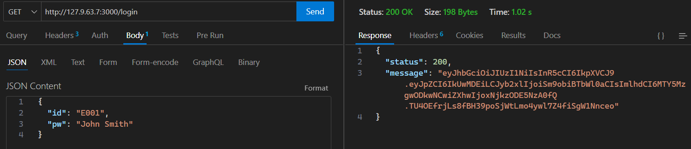
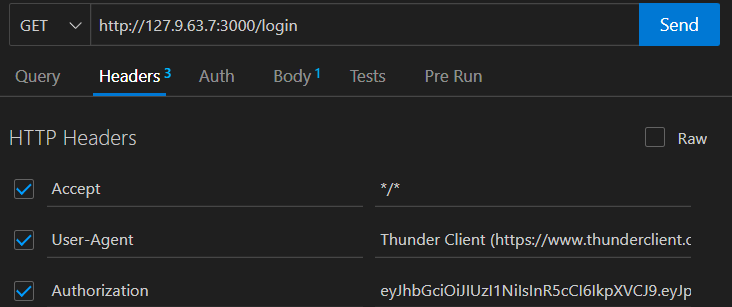

<h1 align="center">ZOODIACO</h1>

---

<h3 align="center">Zoo Research</h3>

This project involves a database for managing zoo information, including details about animals, employees, species, enclosures, visitors, and purchases. This database is built on MongoDB, a NoSQL database management system.


------ 

<h3 align="center">Database Structure</h3>


### Main Collections

1. *Animals:*
   - Animal ID (Unique ID)
   - Name
   - Species (reference to Species document)
   - Date of Birth
   - Gender
   - Enclosure (reference to Enclosures document)

2. *Employees:*
   - Employee ID (Unique ID)
   - Name
   - Position
   - Hiring Date
   - Salary

3. *Species:*
   - Species ID (Unique ID)
   - Scientific Name
   - Description

4. *Enclosures:*
   - Enclosure ID (Unique ID)
   - Name
   - Habitat Type
   - Maximum Capacity

5. *Visitors:*
   - Visitor ID (Unique ID)
   - Name
   - Visit Date
   - Group Size
   - Contact (email or phone number)

6. *Purchases:*
   - Purchase ID (Unique ID)
   - Visitor ID (reference to Visitors document)
   - Purchase Date and Time
   - Total Amount
   - Purchased Items (may be a list)

--- 

<h3 align="center">Relationships</h3>


- The Animals collection contains references to the Species and Enclosures collections.
- The Purchases collection contains references to the Visitors collection.

---

<h3 align="center">Queries and Operations</h3>
 

- Query all animals in a specific enclosure.
- Find employees hired after a specific date.
- Get information about a specific species and its characteristics.
- Display all purchases made by a specific visitor.
- Calculate the total income generated by purchases in a specific time period.
- Find visitors who have made purchases above a certain amount.

---

**Note**: This project uses MongoDB as a NoSQL database management system to store and query zoo information.

---

<h1 align="center">PREREQUISITES</h1>

Before using Zoodiaco, make sure you have the following installed:

- [Node.js](https://nodejs.org/es).
- [Docker](https://www.docker.com/).

## Installation

1. **Clone this repository**:

   ```bash
   git clone https://github.com/Davidpereznuma10/zoodiaco.git
   cd zoodiaco
   ```

2. **Install project dependencies**:

   ```bash
   npm install
   ```

3. **Copy the example environment variable file and configure it**:

   ```bash
   cp .env.example .env
   ```

   Edit the `.env` file with the appropriate settings.

## Configuration

1. **Ensure you configure the `.env` file** with the correct values for your environment lik [`.env.example`](https://github.com/Davidpereznuma10/zoodiaco/blob/Master/.env.example):

   ```env
   # Config
   PORT=3000
   HOST=127.9.63.7

   # Mongo
   DB_USER=root
   DB_PASSWORD=root
   DB_HOST=dbzoo.yjgbw2a.mongodb.net
   DB_NAME=db_zoo
   DB_PORT=27017
   ```

2. **Make sure you have Docker installed on your system**. If you haven't already installed it, you can download Docker from [Docker](https://www.docker.com/get-started).

3. **At the root of the project, use the following command to build the container image**:

   ```bash
   sudo docker-compose build
   ```

   This will generate the container image using the configuration defined in the `docker-compose.yml` file.

## Execution

To run Zoodiaco in a Docker container, follow these steps:

1. Once the image has been successfully built, **start the container with the following command**:

   ```bash
   docker-compose up
   ```

   This will launch the Zoodiaco application and the MongoDB database in separate containers and connect them automatically.

2. When you want to **stop and remove the containers**, use the following command:

   ```bash
   docker-compose down
   ```

   This will shut down the containers and remove associated resources.

## Verification

Once you have run the application, you can verify its status in the console. If it has executed successfully, you will see the following information:

- **Server on:** This link will take you to the web application server.
- **Mongo link:** This link will provide you with information about the MongoDB database connection, but it will not reveal the direct connection details.

Example:

```bash
Server on: http://hostname:PORT
Mongo link: mongodb+srv://<user>:<password>@<host>/<database>?retryWrites=true&w=majority
```

These links will allow you to access the web application server and obtain information about the database connection without revealing the details of the direct connection.

For more details about container configuration and environment variables, refer to the [`docker.md`](https://github.com/Davidpereznuma10/zoodiaco/blob/Master/docker.md) file.

## API Documentation

The complete API documentation is available in the [api.md](https://github.com/Davidpereznuma10/zoodiaco/blob/Master/api.md) file.

Make sure to review the documentation for detailed information on routes, available collections, and how to perform queries.

# Generate token

To generate the token, you must go to the route: `http://127.9.63.7:3000/login`

- If you want permission to all endpoints in the **req.body** you must put this data:

   ```json
   {
   "id": "E001",
   "pw": "John Smith"
   }
- ***Optional*** There is another user who only has permissions for the get endpoints:
   ```json
   {
      "id": "E002",
      "pw": "Emily Johnson"
   }
   ```
# Use the token:
1. To use the token, you must copy it first:


2. You must place it in Headers in the Authorization section as in this example:


Now you can access the endpoints that your user allows you to.